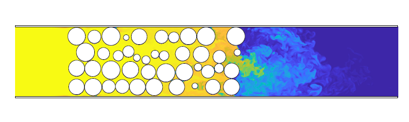

# LB-t - A parallel 3D lattice-Boltzmann CFD solver

Author: [Tobit Flatscher](https://github.com/2b-t) (December 2019 - September 2022)

[](https://github.com/2b-t/LB-t/actions/workflows/update-dockerhub.yml) [](https://github.com/2b-t/LB-t/actions/workflows/build.yml) [](https://github.com/2b-t/LB-t/actions/workflows/run-tests.yml) [](https://codecov.io/gh/2b-t/LB-t) [](https://www.codacy.com/gh/2b-t/LB-t/dashboard?utm_source=github.com&amp;utm_medium=referral&amp;utm_content=2b-t/LB-t&amp;utm_campaign=Badge_Grade) [](https://isocpp.org/std/the-standard) [](https://opensource.org/licenses/MIT)


**This branch (`devel`) is currently work in progress - for the functional and tested version refer to the legacy `main` branch!**

[](https://www.youtube.com/watch?v=7SR4vhMnWZc "Turbulent gaseous flow in porous media")


## Overview

This is a library for **computational fluid mechanics (CFD) based on the lattice-Boltzmann method (LBM)**. It extends the initial [LB-t](https://github.com/2b-t/LB-t/tree/v2.4) by grid generation with the [VTK library](https://vtk.org/) as well as full unit-testing. In order to reduce dependencies it can also be compiled without VTK for a minimum number of dependencies. For more details on installation and usage refer to the following documentation as well as to the documentation contained in `doc/`. The structure of the repository can be found below:

```bash
.
├── doc/               # general documentation
│   ├── Docker.md        # explains how a Docker can be used to run the code without installing it on the host system
│   ├── Install.md       # the installation manual for different operating systems
│   ├── Performance.md   # discusses the integrated tools that can be used to benchmark the code
│   ├── TestCases.md     # explains the physical test cases that were used to verify the code
│   ├── UnitTests.md     # explains the reasoning behind the unit-test suite and how it can be launched
│   └── ...
├── docker/            # contains a Docker container as well as a Docker-Compose configuration file
├── examples/          # contains Json configuration files showing how the standalone can be started
├── src/               # contains the source code
│   ├── .../
│   ├── CMakeLists.txt   # CMake file for the library and executable
│   └── ...
├── test/              # contains over 1000 unit-tests guaranteeing the correct functionality
│   ├── .../
│   ├── CMakeLists.txt   # CMake file for the unit-tests
│   └── ...
├── .devcontainer/     # contains configuration files for containers in Visual Studio Code
└── .vscode/           # contains configuration files for Visual Studio Code
```


## FAQ

- **Who is this code for?**
  Additionally to people using the code for the obvious reason of fluid dynamics simulations this code is mainly intended for people getting started with their own computational fluid dynamics frameworks based on the lattice-Boltzmann method that are interested in obtaining high performance while guaranteeing flexibility and are looking for a fully-tested example with automated benchmarks to compare their implementations to.
- **What are the advantages over other existing implementations?**
  - The code uses modern **C++17** and also includes some features of **C++20** that will be gradually rolled-out in future releases.
  - The framework is **fully templated** with type **traits** for custom **lattices** and **memory access patterns**. This allows e.g. to benchmark A-A and A-B access patterns based on the same implementation and allows the user to simply specifying a new memory access pattern or other lattices, such as compressible lattices, by specialising the traits.
  - The code is fully **multi-threaded** leveraging on **OpenMP** for parallelisation. The code is designed with parallelisation in mind and reduces the memory impact with a A-A access pattern. In this case the code scales with well over 80% scalability over most common many-core processors.
  - Optimised implementations of collision operators are provided with **AVX2 and AVX512 vector intrinsics**.
  - The code has **minimal dependencies**. It can compile with basic **Make** without any library other than the C++ standard libraries. Additionally modules for Json parsing with [nlohmann::json](https://github.com/nlohmann/json) as well as geometry pre-processing with [VTK](https://vtk.org/) can be included if desired, simplifying the usage.
  - The **geometry pre-processing and grid-generation** is handled by the powerful [**VTK library**](https://vtk.org/). If this functionality is not desired the user can also only work with mathematically specified geometries, losing flexibility but also reducing the required dependencies.
  - The framework leverages on **`constexpr` mathematical calculations** at compile-time in particular for the type traits. For this purpose it includes an own small `constexpr` mathematical library that is also fully unit-tested.
  - The framework includes own **classes for physical units** and **user-defined literals**.
  - It also includes a simple **fluid material library** that can estimate density and viscosity of various gases.
  - The code aims at being **fully unit-tested**. Currently this is achieved by over 200 parameterised and templated test suits resulting in over 1000 individual automated unit tests.
  - The code comes with a **Docker** container and a corresponding CI toolchain. This simplifies execution and testing on a new system while having virtually no overhead.
  - The code is **fully documented with Doxygen** that includes references to literature and relevant papers.


## License

This framework is released under the [**MIT license**](https://opensource.org/licenses/MIT).
