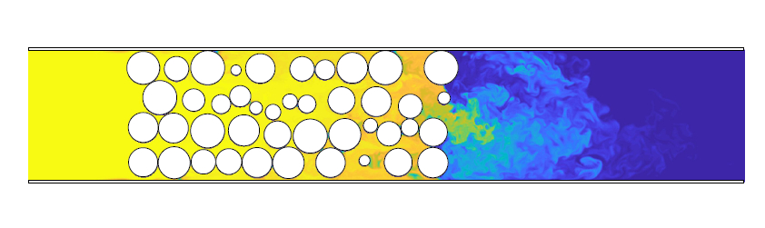

   

# LB-t - A parallel 3D lattice-Boltzmann CFD solver

Author: [Tobit Flatscher](https://github.com/2b-t) (December 2019 - July 2022)

## Overview

This code is an improved demo version of initial [LB-t](https://github.com/2b-t/LB-t) that uses the [VTK library](https://vtk.org/) for grid generation from CAD models. In order to reduce dependencies it can be also compiled without the library for a minimal number of dependencies.

For installation and usage refer to the following documentation.

## Documentation

The documentation is structured as follows:

- The **installation** for different operating systems can be found in [`doc/Install.md`](doc/Install.md)
- [`doc/Docker.md`](doc/Docker.md) discusses how one can use a **Docker** to run the code without installing it on the host system
- [`doc/UnitTests.md`](doc/UnitTests.md)  and [`doc/TestCases.md`](doc/TestCases.md) what **unit tests and physical test cases** were considered to verify the code and how they can be launched.
- [`doc/PerformanceBenchmarks.md`](doc/PerformanceBenchmarks.md) discusses the impact on **performance** and the integrated tools can be used to benchmark the computational performance of a system.

## FAQ

- **Who is this code for?**
  Additionally to people using the code for fluid dynamics simulations this code is mainly intended for people getting started with their own computational fluid dynamics frameworks based on the lattice-Boltzmann method that are interested in obtaining high performance while guaranteeing flexibility and are looking for a fully-tested example with automated benchmarks to compare their implementations to.
- **What are the advantages over other existing implementations?**
  - The code uses modern **C++17** and also includes some features of **C++20** that will be gradually rolled-out in future releases.
  - The framework is **fully templated** with type **traits** for custom **lattices** and **memory access patterns**. This allows e.g. to benchmark A-A and A-B access patterns based on the same implementation and allows the user to simply specifying a new memory access pattern or other lattices, such as compressible lattices, by specialising the traits.
  - The code is fully **multi-threaded** leveraging on **OpenMP** for parallelisation. The code is designed with parallelisation in mind and reduces the memory impact with a A-A access pattern. In this case the code scales with well over 80% scalability over most common many-core processors.
  - Optimised implementations of collision operators are provided with **AVX2 and AVX512 vector intrinsics**.
  - The code uses several **zero-cost abstraction layers for the underlying memory containers**. This allows for a **compilation for accelerator cards** with Nvidia's NVCC.
  - The code has **minimal dependencies**. It can compile with basic **Make** without any library other than the C++ standard libraries. Additionally modules for json parsing as well as geometry pre-processing with VTK can be included if desired, simplifying the usage.
  - The **geometry pre-processing and grid-generation** is handled by the powerful **VTK library**. If this functionality is not wished the user can also only work with mathematically specified geometries, losing flexibility but also reducing the required dependencies.
  - The framework leverages on **`constexpr` mathematical calculations** at compile-time in particular for the type traits. For this purpose it includes an own small `constexpr` mathematical library.
  - The framework includes own **classes for physical units** and **user-defined literals**.
  - It also includes a simple **fluid material library** that can estimate density and viscosity of various gases.
  - The code is **fully unit-tested** with a coverage of nearly 100%. This is achieved by over 200 parameterised and templated test suits resulting in close to 1000 individual automated unit tests.
  - The code comes with a **Docker** container and a corresponding CI toolchain. This simplifies execution and testing on a new system while having virtually no overhead.
  - The code is **fully documented with Doxygen** that includes references to literature and relevant papers as well as installation guides.

## License

TO DO: License, note on benchmarks, no guarantee to be correct
